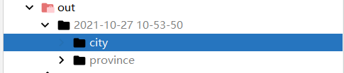

# create-map-geo-date
基于nodejs语言编写的脚本语言,爬取中国地图的所有省份、城市边界数据,生成各省、市的边界json文件。

## Based on the environment
nodejs(v8+)、npm

## Getting Started

Install dependencies

```bash
$ npm
```

Start the dev server

```bash
$ npm start
```

##运行截图



